# <h1 align="center">JUGGLER Multi-Program Tool</h1>
<h2>Welcome</h2>

view the live project [CLICK HERE!](https://juggler-p3-8ea65e7afcc7.herokuapp.com/)

# Introduction

 [Juggler website](https://juggler-p3-8ea65e7afcc7.herokuapp.com/), This Python script is designed to be a versatile utility, offering users a suite of handy programs to perform various tasks efficiently. Whether you need to convert numbers into words, check the weather forecast, determine the day of the week for a specific date(find the day of birth), count characters in a text, or simply play a number guessing game, the Juggler has got you covered!
 
 # Table of Contents

- [Juggler](#juggler-multi-program-tool)
- [Introduction](#introduction)
- [Table of Contents](#table-of-contents)
- [User Goals and Stories (UX)](#user-goals-and-stories-ux)
    - [The user's goals](#user-goals)
    - [The user's stories](#user-stories)
- [Owner Goals and Stories (UX)](#owner-goals-and-stories-ux)
    - [The owner's goals](#owner-goals)
    - [The owner's stories](#owner-stories)
- [Design of the website](#design-of-the-website)
    - [Flowchart - Using LUCID](#flowchart---using-lucid)
    - [Colors - Using COLORAMA](#colors---using-colorama)
    - [Text](#text)
- [Features](#features)
    - [Existing Features](#existing-features)
        - [Juggler Main Function](#juggler-main-function)
        - [Program1: Convert Numbers into Words](#program1-convert-numbers-into-words)        
        - [Program2: Get Weather](#program2-get-weather)
        - [Program3: Get Day of Birth](#program3-get-day-of-birth)
        - [Program4: Count All Characters](#program4-count-all-characters)
        - [Program5: Guess a Number](#program5-guess-a-number)
    - [Future Features](#future-features)
        - [Existing Program Enhancement Ideas](#existing-program-enhancement-ideas)
        - [Addition of New Future Program Enhancement Ideas](#addition-of-new-future-program-enhancement-ideas)
- [Languages Used](#languages-used)
- [Technologies Used](#technologies-used)
- [Tools Used](#tools-used)
    - [Python Libraries](#python-libraries)
    - [Other Tools](#other-tools)
- [Classes and Functions in Juggler](#classes-and-functions-in-juggler)
- [Imports in Juggler](#imports-in-juggler)
- [Testing]()
    - [Validation](#validation)
    - [Lighthouse](#lighthouse)
    - [Browser Compatibility](#browser-compatibility)

# User Goals and Stories (UX)

## User Goals:

- Perform Various Tasks: Users aim to efficiently perform a variety of tasks, such as converting numbers into words, checking the weather, finding the day of the week for a specific date, counting characters in a text, and playing a number guessing game.
- Access Conveniently: Users want to access and use the tool conveniently, without the need for complex setups or installations.
- Understand Program Functions: Users seek clarity on the functions of each program offered by the tool, enabling them to choose the appropriate program for their needs.
- Interact Intuitively: Users expect an intuitive and user-friendly interface that allows them to interact with the programs seamlessly.
- Receive Feedback and Guidance: Users appreciate feedback and guidance within the tool, including error messages, prompts for input, and clear instructions on how to use each program.

## User Stories:

- As a user, I want to convert numbers into words, so I can easily represent numeric values in text format.
- As a user, I want to check the weather for a specific city, so I can plan my activities accordingly.
- As a user, I want to find out the day of the week for a particular date, so I can recall important events or schedule appointments.
- As a user, I want to count characters in a sentence or phrase, to analyze text data or verify the length of a message.
- As a user, I want to play a number guessing game, for entertainment and to challenge my guessing skills.
- As a user, I want to navigate between different programs easily, so I can switch tasks without hassle.
- As a user, I want to receive clear instructions and feedback from the tool, to understand how to interact with each program effectively.
- As a user, I want to have a smooth and error-free experience, without encountering technical issues or confusing errors.

# Owner Goals and Stories (UX)

## Owner Goals

- Provide Value: The website owner aims to offer a valuable resource for users by providing a suite of versatile programs that cater to various needs and interests.
- Increase Engagement: The website owner seeks to increase user engagement by offering interactive and entertaining programs that encourage users to spend more time on the site.
- Drive Traffic: The website owner wants to attract more visitors to the site by offering unique and useful tools that differentiate the site from competitors.

## Owner Stories:

- As a website owner, I want to offer a diverse range of utility programs, so users can find solutions to their needs conveniently on my site.
- As a website owner, I want to create an engaging and interactive experience for users, encouraging them to explore different programs and features on the site.
- As a website owner, I want to ensure the site is user-friendly and accessible, catering to users of all skill levels and backgrounds.

# Design of the website

## Flowchart - Using [LUCID](https://www.lucidchart.com/)

- The flowchart outlines the process flow for a multi-program tool called "Juggler."
- The flowchart depicts the main menu and the various programs available within the Juggler tool. Each program is represented as a separate process with its own set of functionalities.

## Colors - Using COLORAMA

- Colorama is a Python library designed to simplify the process of adding colored text and styling to terminal output. It provides an easy-to-use interface for printing colored text in the terminal, making command-line interfaces (CLI) more visually appealing and easier to read.

- Installation
You can install Colorama using pip, the Python package manager. Simply run the following command in your terminal: pip install colorama

## Text

Most of the text is written  by the author.
Some text for README.md is taken from Google and is rephrased by the author.

# Features

## Existing Features

### Juggler Main Function
The main() function in Juggler serves as the entry point and central control mechanism for the entire multi-program tool. 
The main() function is responsible for displaying the welcome message, presenting the user with program choices, and handling user input to execute the selected program functionalities. It serves as the backbone of the Juggler tool, coordinating the flow of operations and interactions with the user.

### Program1: Convert Numbers into Words
- Description: Program1 allows users to convert numeric input into its word representation. It supports a wide range of numbers up to trillion.
- Usage: Users input a whole number within the range of 1 to trillion, and the program converts it into words. For example, entering "123" would result in "one hundred twenty-three".
- Implementation: The conversion logic is implemented using a Python function that handles various cases based on the magnitude of the input number.

### Program2: Get Weather
- Description: Program2 retrieves current weather information for a specified city or country using the OpenWeatherMap API.
- Usage: Users input the name of a city or country, and the program fetches and displays the current weather conditions, including temperature, humidity, wind speed, and weather description.
- Implementation: The program utilizes the requests library to send HTTP requests to the OpenWeatherMap API and parse the JSON response to extract relevant weather data.

### Program3: Get Day of Birth
- Description: Program3 determines the day of the week based on a person's date of birth.
- Usage: Users input their date of birth in the format "dd-mm-yyyy", and the program calculates and displays the corresponding day of the week (e.g., Monday, Tuesday, etc.).
- Implementation: The program uses Python's datetime module to parse the input date string and extract the day of the week from the resulting datetime object.

### Program4: Count All Characters
- Description: Program4 counts the occurrences of alphabets, numbers, special characters, and spaces in a given text.
- Usage: Users input a phrase or sentence, and the program analyzes the input text to count and display the number of alphabets, numbers, special characters, and spaces present.
- Implementation: The program iterates through each character in the input text and categorizes them into different groups based on their type (alphabet, number, special character, or space), then counts the occurrences of each group.

### Program5: Guess a Number
- Description: Program5 implements a number guessing game where the user tries to guess a secret number within a specified range.
- Usage: Users are prompted to guess a number between 1 and 10, and the program provides feedback based on whether the guess is too high, too low, or correct.
- Implementation: The program generates a random secret number within the specified range and compares the user's guess with the secret number to determine the outcome.

## Future Features

### Existing Program Enhancement Ideas:

**Program1: Convert Numbers into Words.**
- Support Negative Numbers: Enable converting negative numbers into words.
- Decimal Numbers: Allow conversion of decimal numbers (e.g., 123.45) into words.

**Program2: Get Weather**

- More Details: Provide additional weather details like hourly forecasts.
- Location Detection: Automatically detect the user's location to fetch weather information.

**Program3: Get Day of Birth**

- Age Calculation: Add the option to calculate the user's age from their birthdate.

**Program4: Count All Characters**

- Text Classification: Categorize input text into predefined categories.

**Program5: Guess a Number**

- Difficulty Levels: Offer different difficulty levels with varied ranges or complexity.
- Multiplayer Mode: Allow multiple users to guess the number simultaneously.

### Addition of New Future Program Enhancement Ideas:

Addition of new programs could further enrich the functionality and usability of the Juggler tool. This features aim to expand the capabilities of Juggler, providing users with more diverse and advanced tools for text manipulation, data analysis, and other tasks. Example: Text Encryption/Decryption, Data Visualization.

# Languages Used

- [PYTHON](https://www.python.org/) used as the back-end programming language.
Python is a primary programming language used for developing the core functionality of the Juggler tool. It offers simplicity, readability, and a vast ecosystem of libraries and frameworks that facilitate rapid development.
- [HTML5](https://en.wikipedia.org/wiki/HTML5) (Hypertext Markup Language) or HTML, was used to design the basic website. 
HTML was already implemented in the [CODEINSTITUTE TEMPLATE](https://github.com/Code-Institute-Org/p3-template). This also has embedded CSS. This template is used for building Jugger Tool. Few changes were made for Juggler color and terminal width.

# Technologies Used

- [GitHub](https://github.com/). It provides version control using Git, enabling developers to track changes to their codebase, collaborate with others, and manage their projects efficiently.
- [GitPod](https://www.gitpod.io/). Gitpod is an online integrated development environment (IDE) that allows developers to write, review, and manage code directly within a web browser.
- [Heroku](https://www.heroku.com/). Heroku is a cloud platform as a service (PaaS) that enables developers to build, deploy, and manage web applications quickly and easily. It supports multiple programming languages, including Ruby, Node.js, Python, Java, PHP, and Go, allowing developers to work with their preferred tools and frameworks. 

# Tools Used

## Python Libraries

- [Requests Library](https://pypi.org/project/requests/)
The Requests library is utilized in Juggler for making HTTP requests to external APIs, such as the OpenWeatherMap API for retrieving weather information. It simplifies the process of sending and receiving data over the web.
- [Colorama Library](https://pypi.org/project/colorama/)
Colorama is a Python library used for adding colored text and styling to the command-line interface of the Juggler tool. It enhances the visual appeal and user experience by providing colored output for different messages and prompts.
- [Dotenv Library](https://pypi.org/project/python-dotenv/)
Dotenv is employed for loading environment variables from a .env file into the Juggler application. It enables configuration settings, such as API keys or sensitive information, to be stored separately from the main codebase and easily managed.

## Other Tools

- [Am I Responsive](https://ui.dev/amiresponsive) was used to get a responsive image for README.
- [OpenWeatherMap](https://openweathermap.org/) was used to retrieve current weather information for any city or country. 

# Classes and Functions in Juggler

- `get_api_key()`
   -  Retrieves the API key for accessing the OpenWeatherMap API.
- `get_weather(api_key, city)`
   - Fetches current weather information for a specified city using the OpenWeatherMap API.
- `number_to_words(number)`
    - Converts a given integer number into its word representation.
- `get_day_of_birth(date_str)`
    - Determines the day of the week a person was born based on their date of birth.
- `count_characters(input_text)`
    - Counts the occurrences of each character in the input text.
- `guess_a_number(lower_limit, upper_limit)`
    - Plays the number guessing game where the user tries to guess a secret number within a specified range.
- `welcome_msg()`
    - Displays the welcome message and introduction text when the Juggler tool is launched.
- `clear_terminal()`
    - Clears the terminal screen.
- `handle_user_choice()`
    - Handles user choice for continuing, returning to the main menu, or exiting the program.
- `main()`
    - Main function that orchestrates the execution of different programs within the Juggler tool.

# Imports in Juggler

- `os`- Provides a portable way to interact with the operating system.
- `requests` - Enables sending HTTP requests to web servers and receiving responses.
- `json` - Provides functions for encoding and decoding JSON data, of Python objects to and from JSON format.
- `pytz`- Provides timezone information.
- `datetime` - Provides classes for working with date and time values, including the creation, manipulation, and formatting of datetime objects.
- `time` - Provides functions for working with time values, including sleeping, measuring time intervals, and accessing the current system time.
- `random` - Provides functions for generating pseudo-random numbers, allowing the creation of randomized elements in programs.
- `dotenv` - Loads environment variables from a .env file into the environment.
- `colorama` - Provides cross-platform support for colored terminal text.

# Testing

## Validation 

I have used the recommended [PEP8 CI Python Linter](https://pep8ci.herokuapp.com) to validate all of my Python files.
The following report is the validation results with no errors and no warnings.
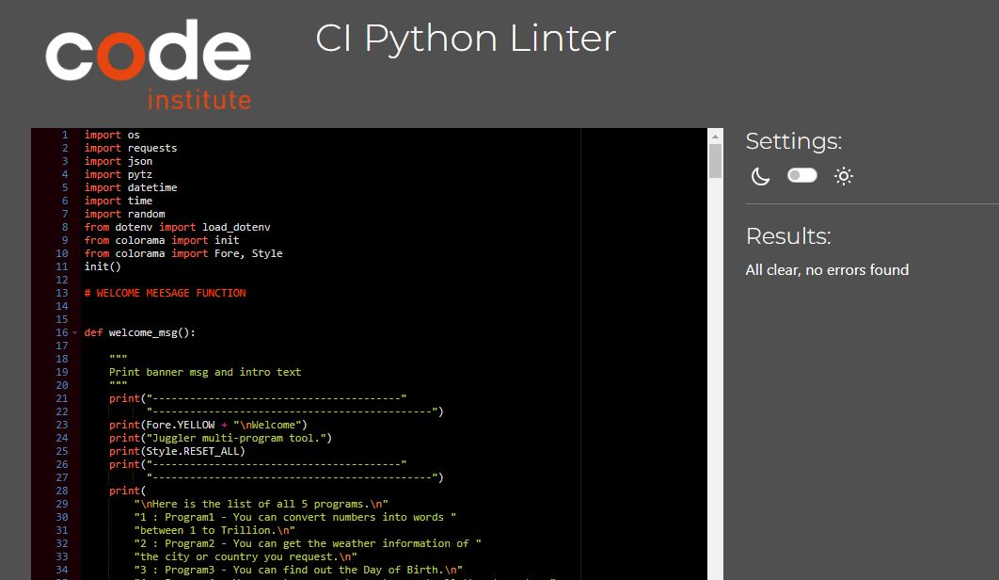

## Lighthouse

[Lighthouse in Chrome Developer Tools](https://en.wikipedia.org/wiki/Google_Lighthouse) was used to check performance.
The following lighthouse report was run on the finished deployed website to check performance.
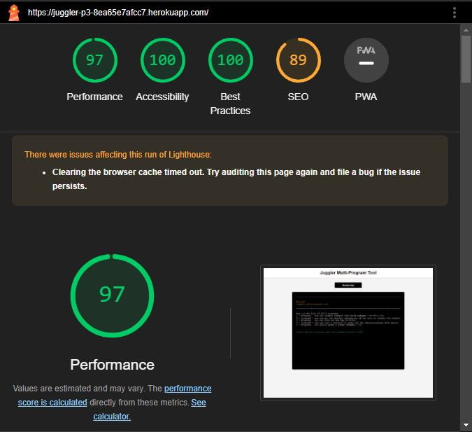

## Browser Compatibility

Browser tests on Chrome, Firefox, and Microsoft Edge revealed no issues with the website.

## Manual Testing and User Stories Testing

- All manual tests and user stories are explained with screenshots.

**Installation** - Ensured all required dependencies are installed correctly.

**Execution** -  Ensured that the tool launches without errors and displays the welcome message and program menu correctly.
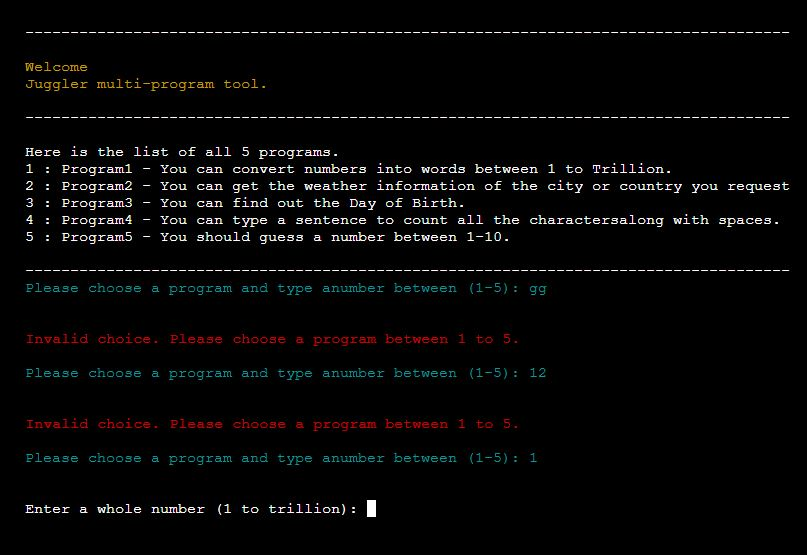

**Program Functionality** -  Tested each program within the Juggler tool individually to verify that it performs as expected. This includes converting numbers into words, retrieving weather information, determining the day of birth, counting characters, and playing the number guessing game.

**User Input Handling** - Test various inputs (valid and invalid) for each program to ensure that the tool handles user input correctly and provides appropriate error messages when necessary.
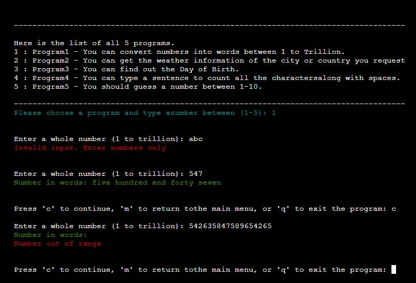
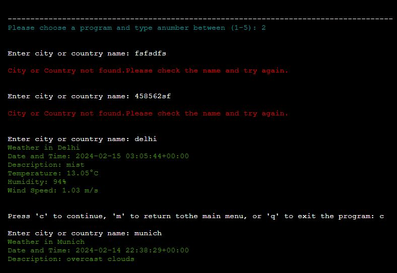
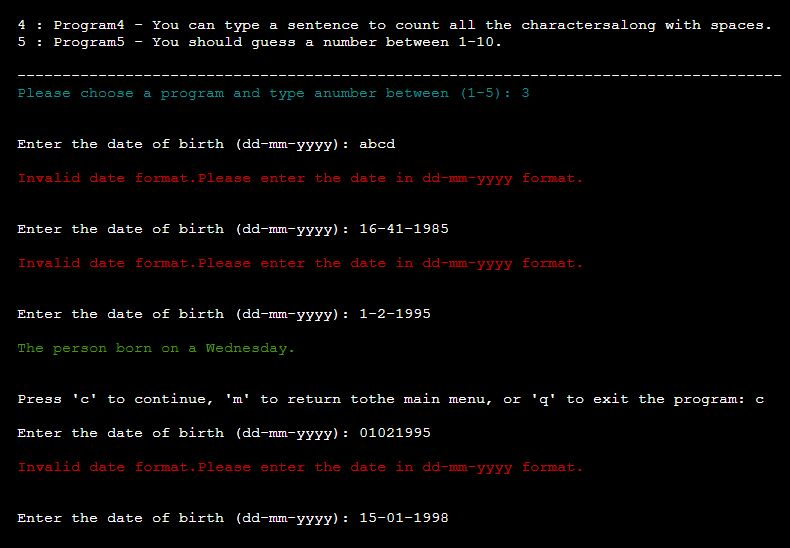
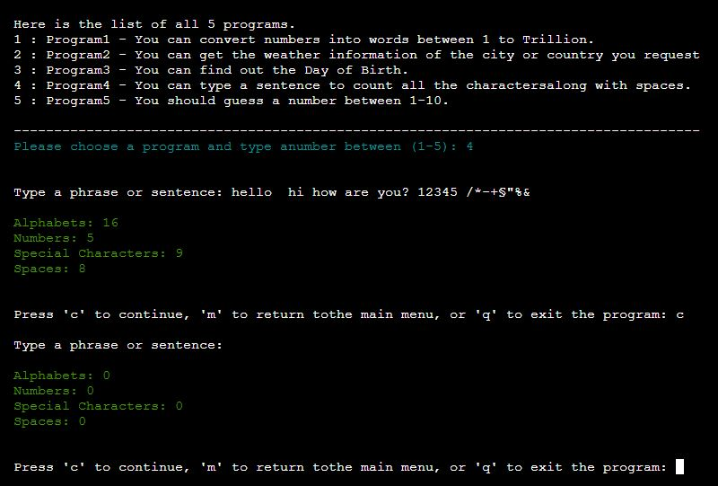
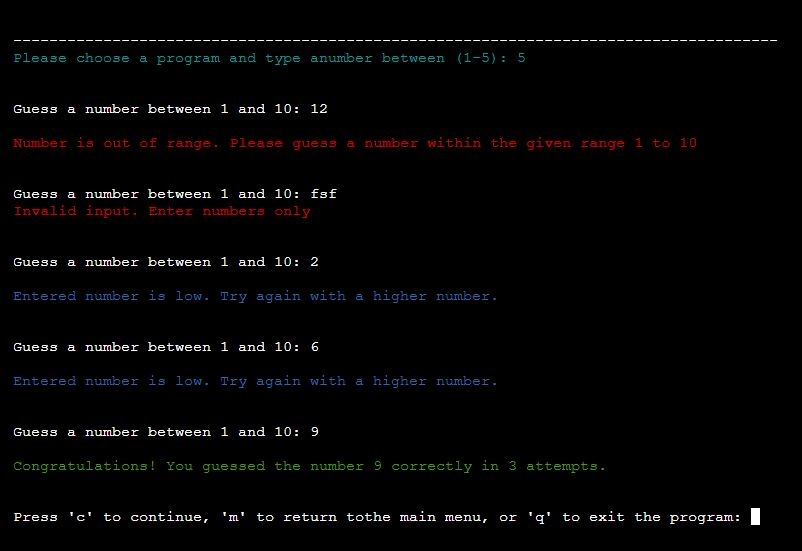

**Edge Cases** - Test edge cases and boundary conditions to ensure that the tool behaves correctly under different scenarios, such as large numbers for number conversion, non-existent cities for weather information, and invalid dates for day of birth calculation.
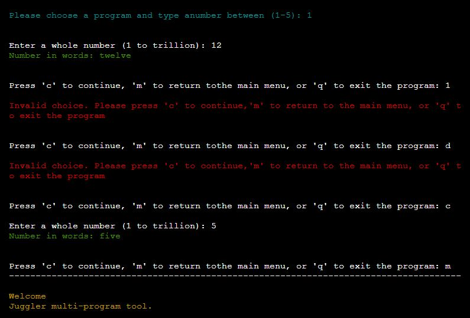

**Error Handling** - Test error handling mechanisms to ensure that the tool gracefully handles unexpected errors and exceptions, providing clear error messages to the user.  

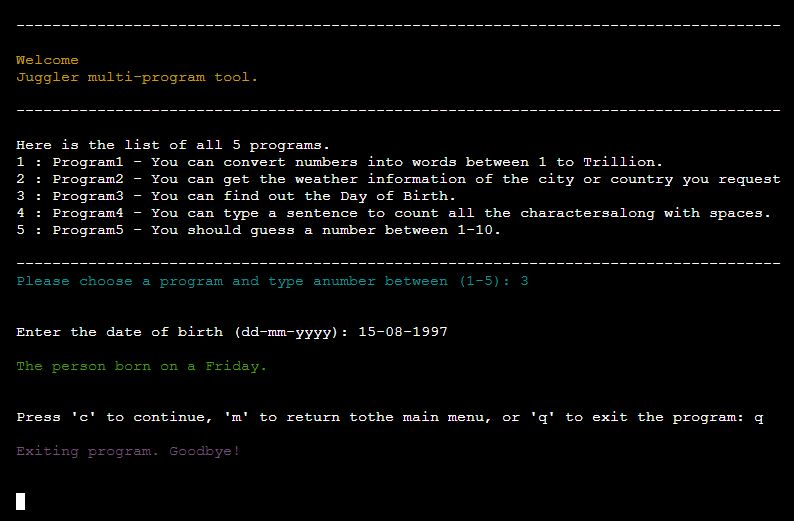

**Usability** - Evaluate the overall usability and user experience of the tool, considering factors such as clarity of instructions, ease of navigation, and responsiveness of the interface.
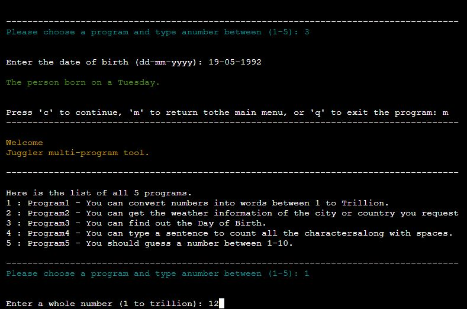

# Deployment

The way Juggler was step up as follows:

1. Sign Up or Log In to Heroku: Visit the Heroku website and sign up or log in.
2. Create a New App: Once logged in, click on the **New** button in the top-right corner and select **"Create new app"**. Enter a unique name for your app and choose a region closest to you. Then, click on the **Create App** button.
3. You need an API_KEY for Juggler. To get an API key from OpenWeatherMap, you need to follow these steps:

- Sign Up/Login: Go to the OpenWeatherMap website and sign up for a new account, or log in if you already have an account.
- Access API Keys: After logging in, navigate to your account dashboard.
- Generate API Key: Look for the section that provides access to API keys. It may be labeled as "API Keys", "My Subscriptions", or something similar. Click on it to generate a new API key.
- Choose Plan (if applicable): Depending on your usage and requirements, you may need to choose a plan (e.g., Free, Basic, Pro) to access certain features or to increase usage limits.
- Copy API Key: Once the API key is generated, copy it to your clipboard.
- Use API Key: You can now use this API key in your applications to access weather data from OpenWeatherMap's APIs.

4. From the new app **Settings**, click **Reveal Config Vars**, and set the value of KEY to `OPENWEATHERMAP_API_KEY`, and the value to `YOUR_API_KEY` then select *add*.
5. Further down, to support dependencies, select **Add Buildpack**. The order of the buildpacks is important, select `Python` first, then `Node.js` second.
6. Heroku needs additional files in order to deploy properly `requirements.txt`.
You can install this project's **requirements** (where applicable) using:
- `pip3 install -r requirements.txt`
If you have your own packages that have been installed, then the requirements file needs updated using:
- `pip3 freeze > requirements.txt`
7. Connect to GitHub: After creating your app, navigate to the **"Deploy"** tab and choose **"GitHub"** as your deployment method. Connect your Heroku account to your GitHub account and search for the Juggler repository. Once found, click on the **"Connect"** button to link your Heroku app to the GitHub repository.
8. Deploy Branch: After connecting to GitHub, choose the branch you want to deploy (usually "master" or "main") and click on the "Deploy Branch" button. Heroku will automatically fetch the latest code from your GitHub repository and deploy it to your app.

Finally click on the **"View"** button to open newly deployed Juggler app in your web browser. You can now access Juggler directly from Heroku and start using its features!

# Cloning

You can clone the repository by following these steps:

1. Go to the [GitHub repository](https://github.com/SwathiKeshavamurthy/Juggler-P3) 
2. Locate the Code button above the list of files and click it 
3. Select if you prefer to clone using HTTPS, SSH, or GitHub CLI and click the copy button to copy the URL to your clipboard
4. Open Git Bash or Terminal
5. Change the current working directory to the one where you want the cloned directory
6. In your IDE Terminal, type the following command to clone my repository:
	- `git clone https://github.com/SwathiKeshavamurthy/Juggler-P3.git`
7. Press Enter to create your local clone.

Alternatively, if using Gitpod, you can click below to create your own workspace using this repository.

Please note that in order to directly open the project in Gitpod, you need to have the browser extension installed.
A tutorial on how to do that can be found [here](https://www.gitpod.io/docs/configure/user-settings/browser-extension).

#  Forking

 Forking the GitHub Repository, we make a copy of the original repository on our GitHub account to view and/or make changes without affecting the original owner's repository.

You can fork this repository by using the following steps:

1. Navigate to the Repository: Login to GitHub and locate [GitHub Repository](https://github.com/SwathiKeshavamurthy/Juggler-P3).
2. Fork the Repository: Click on the "Fork" button in the top-right corner of the repository page. This will create a copy of the repository in your GitHub account.

Now you have a copy of the original repository in your own GitHub account!
