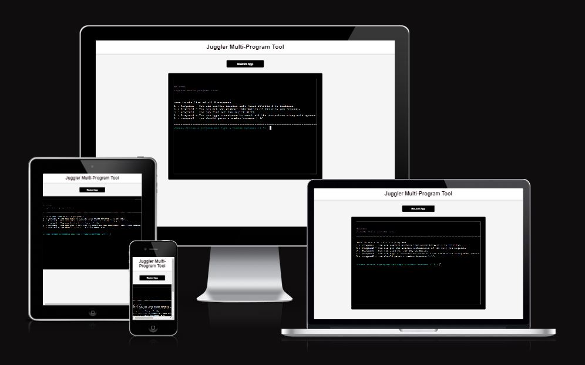

# <h1 align="center">JUGGLER Multi-Program Tool</h1>
<h2>Welcome</h2>

view the live project [CLICK HERE!](https://juggler-p3-8ea65e7afcc7.herokuapp.com/)

# Introduction

 [Juggler website](https://juggler-p3-8ea65e7afcc7.herokuapp.com/), This Python script is designed to be a versatile utility, offering users a suite of handy programs to perform various tasks efficiently. Whether you need to convert numbers into words, check the weather forecast, determine the day of the week for a specific date(find the day of birth), count characters in a text, or simply play a number guessing game, the Juggler has got you covered!
 
 # Table of Contents

- [Juggler](#juggler-multi-program-tool)
- [Introduction](#introduction)
- [Table of Contents](#table-of-contents)
- [User Goals and Stories (UX)](#user-goals-and-stories-ux)
    - [The user's goals](#user-goals)
    - [The user's stories](#user-stories)
- [Owner Goals and Stories (UX)](#owner-goals-and-stories-ux)
    - [The owner's goals](#owner-goals)
    - [The owner's stories](#owner-stories)   

# User Goals and Stories (UX)

## User Goals:

- Perform Various Tasks: Users aim to efficiently perform a variety of tasks, such as converting numbers into words, checking the weather, finding the day of the week for a specific date, counting characters in a text, and playing a number guessing game.
- Access Conveniently: Users want to access and use the tool conveniently, without the need for complex setups or installations.
- Understand Program Functions: Users seek clarity on the functions of each program offered by the tool, enabling them to choose the appropriate program for their needs.
- Interact Intuitively: Users expect an intuitive and user-friendly interface that allows them to interact with the programs seamlessly.
- Receive Feedback and Guidance: Users appreciate feedback and guidance within the tool, including error messages, prompts for input, and clear instructions on how to use each program.

## User Stories:

- As a user, I want to convert numbers into words, so I can easily represent numeric values in text format.
- As a user, I want to check the weather for a specific city, so I can plan my activities accordingly.
- As a user, I want to find out the day of the week for a particular date, so I can recall important events or schedule appointments.
- As a user, I want to count characters in a sentence or phrase, to analyze text data or verify the length of a message.
- As a user, I want to play a number guessing game, for entertainment and to challenge my guessing skills.
- As a user, I want to navigate between different programs easily, so I can switch tasks without hassle.
- As a user, I want to receive clear instructions and feedback from the tool, to understand how to interact with each program effectively.
- As a user, I want to have a smooth and error-free experience, without encountering technical issues or confusing errors.

# Owner Goals and Stories (UX)

## Owner Goals

- Provide Value: The website owner aims to offer a valuable resource for users by providing a suite of versatile programs that cater to various needs and interests.
- Increase Engagement: The website owner seeks to increase user engagement by offering interactive and entertaining programs that encourage users to spend more time on the site.
- Drive Traffic: The website owner wants to attract more visitors to the site by offering unique and useful tools that differentiate the site from competitors.

## Owner Stories:

- As a website owner, I want to offer a diverse range of utility programs, so users can find solutions to their needs conveniently on my site.
- As a website owner, I want to create an engaging and interactive experience for users, encouraging them to explore different programs and features on the site.
- As a website owner, I want to ensure the site is user-friendly and accessible, catering to users of all skill levels and backgrounds.

